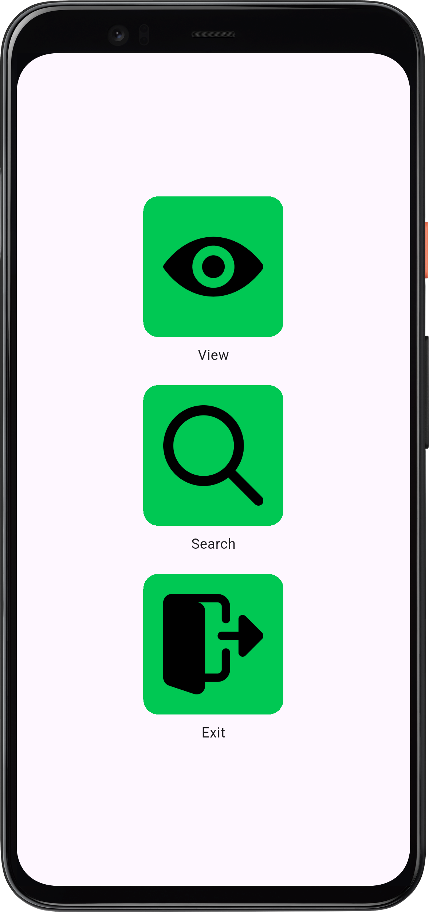
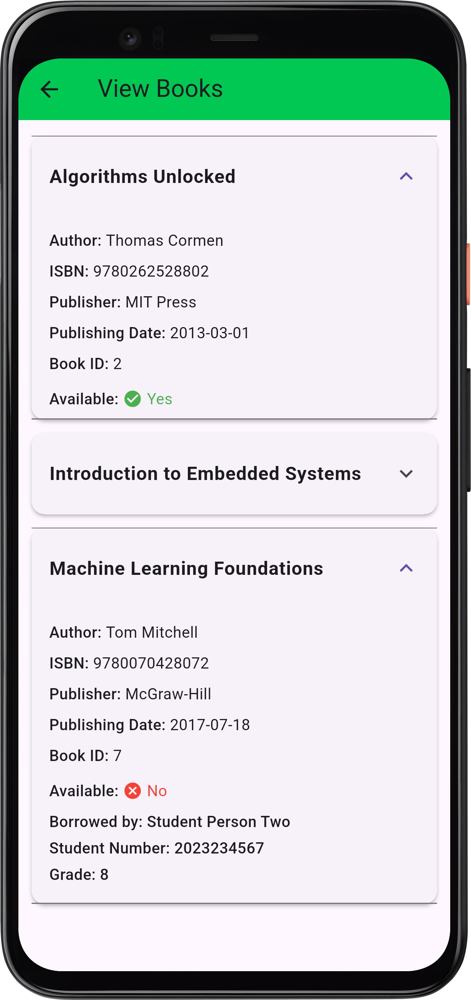
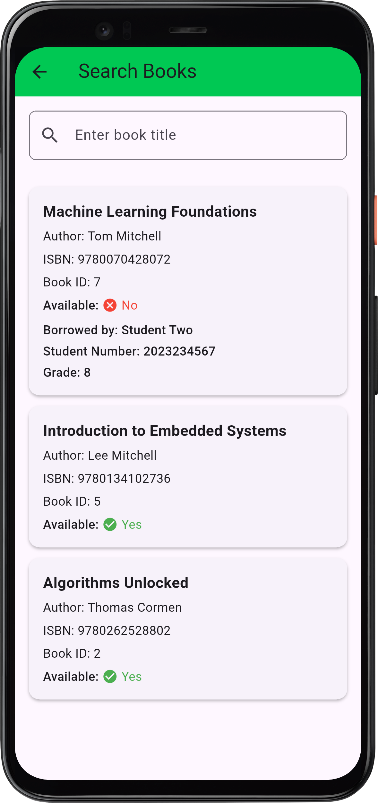

# Library Book Borrowing Management System 📚

A comprehensive, real-time library management application built with **Flutter** and **Firebase Firestore**. This application serves as the primary software interface for tracking book inventory, monitoring availability, and managing student borrowing records.

It is designed to work in tandem with a custom hardware module (ATmega328P, ESP-01S, RFID/QR Scanner) to bridge the gap between physical book tracking and digital record-keeping.

---

## 📱 Screenshots

| Home Dashboard | View Books | Search Inventory |
| :---: | :---: | :---: |
|  |  |  |

---

## ✨ Key Features

* **Real-Time Sync:** Powered by Firebase Cloud Firestore, book statuses update instantly across all instances of the app.
* **Progressive Disclosure:** Uses optimized expansion tiles to keep the UI clean while allowing deep dives into specific book data and borrower details.
* **Smart Search:** Efficient local and database-level querying to find books by title or keyword.
* **Hardware Ready:** Architecture planned for integration with custom physical scanning hardware (RFID/QR) to instantly identify and update book records.
* **Denormalized Database:** Optimized NoSQL structure to prevent N+1 read issues and keep database querying costs low.

---

## 🛠️ Tech Stack & Architecture

### Software (Frontend & Backend)
* **Framework:** [Flutter](https://flutter.dev/) (Dart)
* **Database:** Firebase Cloud Firestore (NoSQL)
* **State Management:** Ephemeral state (StatefulWidgets) & StreamBuilders

### Hardware Integration
* **Microcontroller:** ATmega328P
* **Network Module:** ESP-01S (Wi-Fi)
* **Sensors:** RFID Reader / QR Scanner
* **PCB:** Custom-designed printed circuit board for the scanning terminal.

---

## 🗄️ Firestore Database Structure

The application uses two main collections: `books` and `students`. Borrowed books link to a student via a Document Reference.

### 1. `books` Collection
```json
{
  "bookID": 000,
  "title": "Machine Learning Foundations",
  "author": "Tom Mitchell",
  "publisher": "McGraw-Hill",
  "publishing_date": "2017-07-18",
  "isbn": "9780070428072",
  "is_available": true,
  "title_array": [
    "machine",
    "learning",
    "foundations"
  ],
  "borrower": null // Becomes a DocumentReference to a student when borrowed
}
{
  "student_number": "2021101101",
  "first_name": "Juan",
  "middle_name": "A",
  "last_name": "Dela Cruz",
  "grade": 12
}