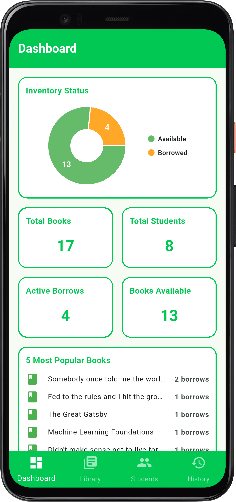
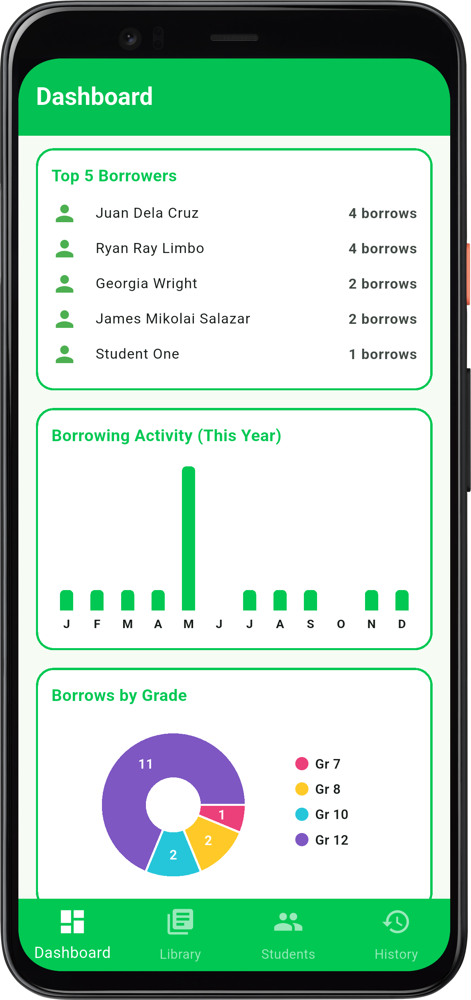
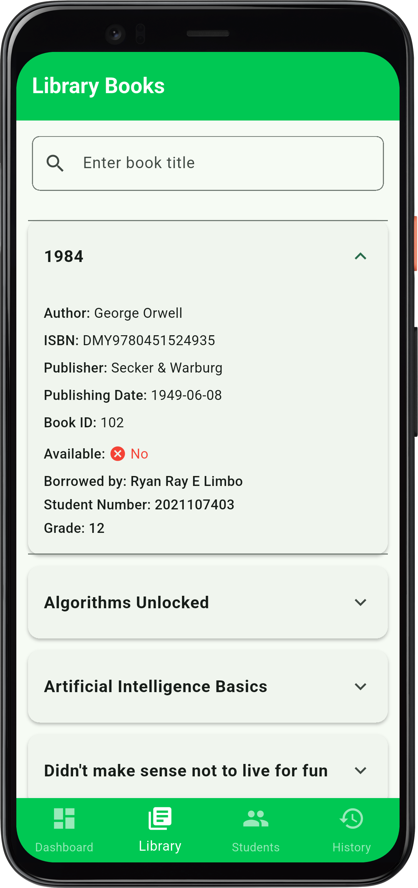
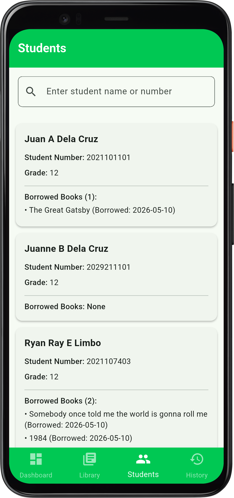
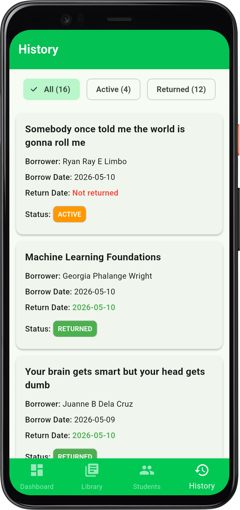
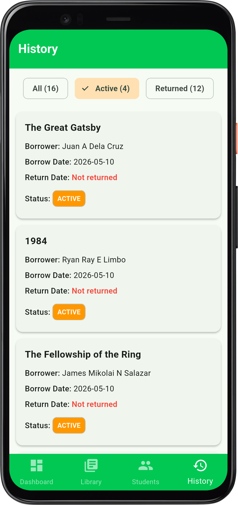
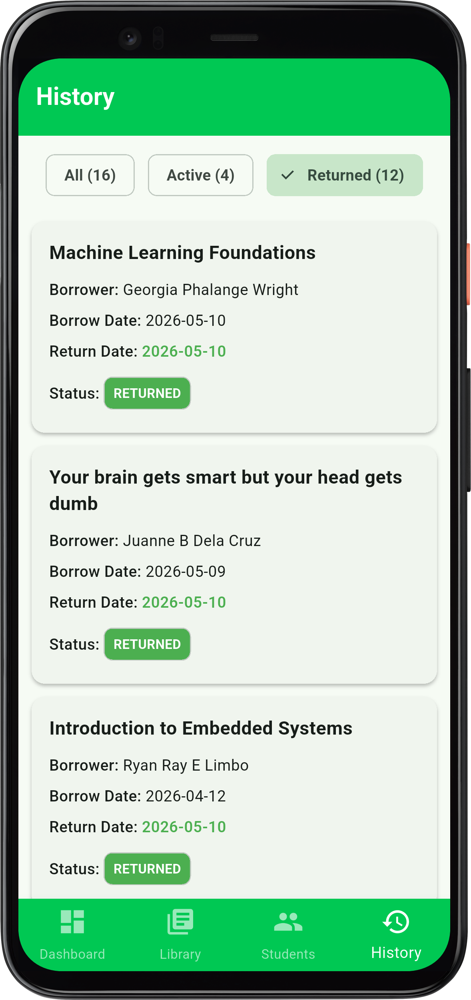

# Library Book Borrowing Management System 📚

A comprehensive, real-time library management application built with **Flutter** and **Firebase Firestore**. This application serves as the primary software interface for tracking book inventory, monitoring availability, and managing student borrowing records.

It is designed to work in tandem with a custom hardware module (ATmega328P, ESP-01S, RFID/QR Scanner) to bridge the gap between physical book tracking and digital record-keeping.

---

## 📱 Screenshots

|             Dashboard (Stats & Popular)              |                  Dashboard (Charts)                  |                  Library Books                   |                   Students List                   |
| :--------------------------------------------------: | :--------------------------------------------------: | :----------------------------------------------: | :-----------------------------------------------: |
|  |  |  |  |

|                   History (All)                    |             History (Active Filtered)              |            History (Returned Filtered)             |
| :------------------------------------------------: | :------------------------------------------------: | :------------------------------------------------: |
|  |  |  |

---

## ✨ Key Features

- **Real-Time Sync:** Powered by Firebase Cloud Firestore, book statuses update instantly across all instances of the app.
- **Progressive Disclosure:** Uses optimized expansion tiles to keep the UI clean while allowing deep dives into specific book data and borrower details.
- **Smart Search:** Efficient local and database-level querying to find books by title or keyword.
- **Hardware Ready:** Architecture planned for integration with custom physical scanning hardware (RFID/QR) to instantly identify and update book records.
- **Denormalized Database:** Optimized NoSQL structure to prevent N+1 read issues and keep database querying costs low.

---

## 🛠️ Tech Stack & Architecture

### Software (Frontend & Backend)

- **Framework:** [Flutter](https://flutter.dev/) (Dart)
- **Database:** Firebase Cloud Firestore (NoSQL)
- **State Management:** Ephemeral state (StatefulWidgets) & StreamBuilders

### Hardware Integration

- **Microcontroller:** ATmega328P
- **Network Module:** ESP-01S (Wi-Fi)
- **Sensors:** RFID Reader / QR Scanner
- **PCB:** Custom-designed printed circuit board for the scanning terminal.

---

## 🗄️ Firestore Database Structure

The application uses three main collections: `books`, `borrows`, and `students`. Relational data is managed via Document References to maintain data integrity across collections.

### 1. `books` Collection

```json
{
    "author": "F. Scott Fitzgerald",
    "bookID": 101,
    "borrower": "/students/2021101101", // DocumentReference (null if available)
    "is_available": false,
    "isbn": "DMY9780743273565",
    "publisher": "Scribner",
    "publishing_date": "1925-04-10",
    "title": "The Great Gatsby",
    "title_array": ["the", "great", "gatsby"]
}
```

### 2. `borrows` Collection

```json
{
    "book_id": "/books/DMY602_7731", // DocumentReference
    "borrow_date": "2024-03-12T08:21:45",
    "borrow_type": "library",
    "due_date": "2024-03-16T08:21:45",
    "return_date": "2026-05-10T14:30:46",
    "status": "returned", // e.g., "active", "returned"
    "student_id": "/students/2023123456" // DocumentReference
}
```

### 3. `students` Collection

```json
{
    "borrows": [
        "/books/DMY772_4921", // DocumentReference
        "/books/DMY9780451524935_102" // DocumentReference
    ],
    "first_name": "Ryan Ray",
    "grade": "12",
    "last_name": "Limbo",
    "middle_name": "E",
    "student_number": "2021107403"
}
```
